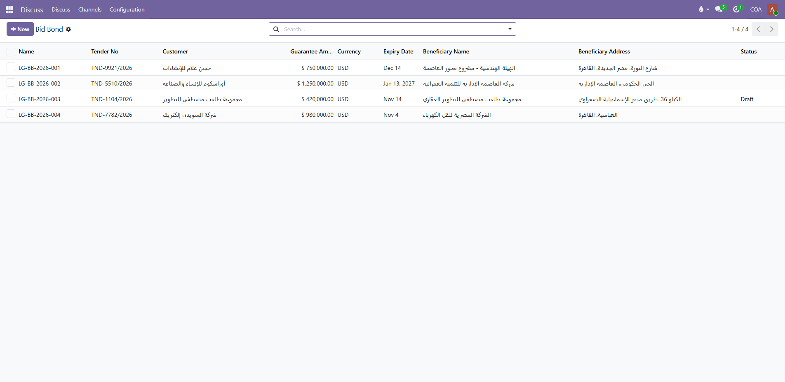
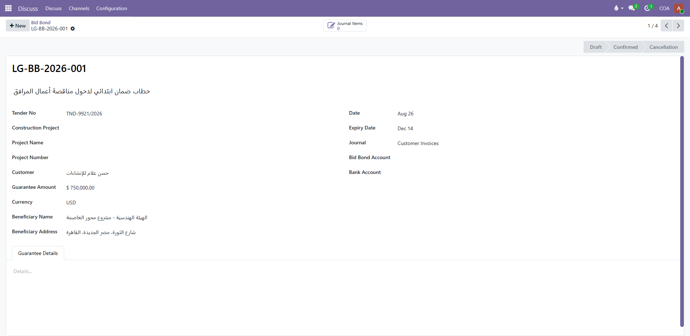
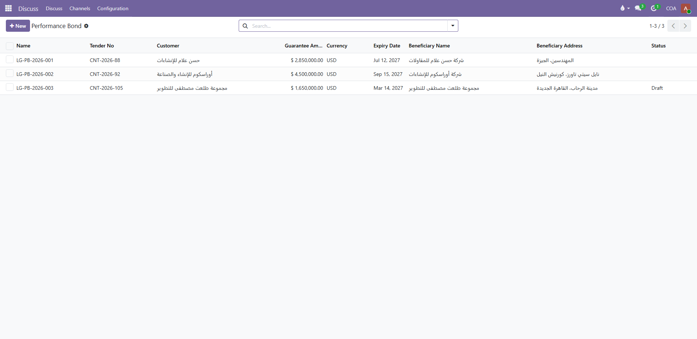
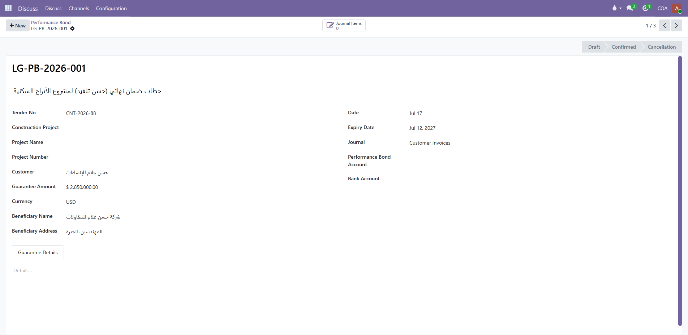

  
  <h1>COA Letters of Guarantee | Bank Guarantee Management</h1>
  
<strong>Comprehensive Lifecycle & Automated Accounting Management for Bid Bonds, Performance Bonds, and Guarantees</strong>

  

    
    
    
    
  

---

## Overview

**COA Letters of Guarantee Management** is an enterprise-grade financial application built for Odoo 19, 18, and 17. It provides financial managers, treasury officers, and project accounting teams with complete automated control over commercial bank letters of guarantee, tenders, and surety bonds.

From draft tender application to bank margin deposit, commission bookings, maturity monitoring, extension renewals, and final release or liquidation, every transaction is backed by automated double-entry journal postings.

---

## Key Features

- **4 Guarantee Types Supported:**
  - **Bid Bonds (Primary Guarantees):** Manage tender entries, submission deadlines, and bid validity.
  - **Performance Bonds (Final Guarantees):** Ensure contract delivery and project execution compliance.
  - **Advance Payment Guarantees:** Protect upfront disbursements and down-payment advances.
  - **Maintenance / Defect Liability Bonds:** Cover post-delivery warranties and maintenance periods.
- **Automated Double-Entry Accounting:**
  - Automatic journal generation for cash margin deposits (cash cover).
  - Explicit bank issuance commission, stamp duties, and banking expense recognition.
  - Automatic cash margin refund journal upon letter release.
- **Proactive Expiration Tracking & Alerts:**
  - Visual color-coded status badges for active, expiring, and overdue guarantees.
  - Full support for bank extension requests and validity prolongation.
- **Multi-Bank & Multi-Currency:**
  - Track guarantee limits, credit lines, and cash margin percentages across various issuing banks.
  - Support for domestic and international tender foreign currencies.
- **Project & Tender Linking:**
  - Directly connect each guarantee to specific tender authorities, partners, projects, and analytic cost centers.
- **Bilingual Interface:** Fully localized in English (`en_US`) and Arabic (`ar_001`).

---

## Application Previews

### 1. Bid Bonds Portfolio Overview

### 2. Bid Bond Detailed Form & Financial Configuration

### 3. Performance Bonds Management

### 4. Performance Bond Form & Accounting Journal Links

---

## Installation & Configuration

1. Place the `coa_letters_of_guarantee` directory into your Odoo custom addons path.
2. Update the Apps list in your Odoo developer mode.
3. Install **COA Letters of Guarantee**.
4. Navigate to **Accounting > Configuration > Settings > Letters of Guarantee** to configure your default Cash Margin, Commission, and Bank accounts.

---

## Technical Support & Contact

- **Author:** Community of Accountants (COA-Egypt)
- **Website:** [https://www.coa-egy.com](https://www.coa-egy.com)
- **Email:** [info@coa-egy.com](mailto:info@coa-egy.com)
